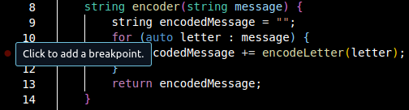
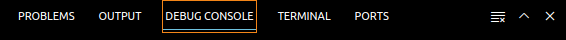

# TP5 : Debugger et gestion des erreurs

:::{important} QCM
:class: dropdown
Les réponses aux questions du TPs sont à remplir dans le QCM sur Moodle.
:::

## Exercice 1 : Code à debugger

Recopier le code suivant.

```{code} cpp
#include <iostream>
#include <string>

using namespace std;

class cesarEncoding {
public:
    string encoder(string message) {
        string encodedMessage = "";
        for (auto letter : message) {
            encodedMessage += encodeLetter(letter);
        }
        return encodedMessage;
    }

private:
    int key = 3;

    char encodeLetter(char letter) {
        letter += key;
        return letter;
    }
};

int main() {
    string message = "A message to encode";
    cesarEncoding encoding;
    cout << encoding.encoder(message) << endl;
    return 0;
}
```

Pour comprendre ce que fait ce code, nous allons utiliser le mode **Run and Debug** de VSCodium.

Avant de commencer, rendez-vous sur [le tutoriel pour le setup du Debugger de *C/C++ Runner*](#vscodium-debugger) et suivre ses instructions.

Maintenant, compiler le code avec `Ctrl+Alt+B`.

:::{warning} `launch.json`
Vérifier le fichier `launch.json` dans le dossier `.vscode`. **Si en face de `type`, vous voyez toujours `gdb` alors il faut le changer en `lldb`.** 

Le changement du template doit vous permettre de ne pas à avoir rechanger `launch.json` à chaque compilation. Si vous avez encore une erreur quand vous faites tourner **Run and Debug**, alors il faut vérifier `launch.json` et vous avez probablement mal fait la manipulation du template dans [le tutoriel](#vscodium-debuuger).
:::

Nous allons ajouter un **breakpoint** à la ligne 11 correspondant au code `encodedMessage += encodeLetter(letter);`[^breakpoint].

[^breakpoint]: 

Cliquer sur le bouton vert **Start Debugging** à côté de *RUN AND DEBUG* [^start_debugging] ou appuyer sur le shortcut **F5**.

[^start_debugging]: 

Vous allez voir apparaître à gauche les différentes **VARIABLES** donc vous avez accès à l'intérieur de la fonction `encoder`.

**Question 1** : Quelles sont ces variables ?

Vous pouvez connaître le type de ces variables en mettant la souris par dessus le nom de la variable.

**Question 2** : Quel est le type de `letter` ici ?

L'exécution du programme est maintenant en pause, vous pouvez contrôler cette exécution grâce à la barre de debug[^debug_bar].
- Le bouton **Continue** (F5) permet de continuer l'exécution qui se remettra en pause quand elle retombera sur le breakpoint. Cliquer sur *Continue* 3 fois.

**Question 3** : Quelle est la valeur de `encodedMessage` (avec les guillemets) ?

- Le bouton **Step Over** (F10) permet de continuer l'exécution instruction par instruction. Utiliser *Step Over* pour déduire la valeur de `encodeLetter(letter)` quand `letter: 's'`. 

**Question 4** : Quelle est cette valeur (avec les guillemets simples) ?

- Le bouton **Step Into** (F11) permet de rentrer dans l'exécution ligne par ligne des (sous-)fonctions appelées (contrairement à *Step Over* qui exécute `encodeLetter(letter)` comme une seule instruction). Cliquer sur *Step Into* jusqu'à ce que vous rentrez dans l'itérateur `auto letter : message`. Vous allez tomber sur un autre fichier de code.

**Question 5** : Quel est le nom de ce fichier (avec l'extension) ?

- Le bouton **Step Out** (Shift+F11) permet de sortir de la sous-fonction que l'on a *Stepped Into*. Sortir de ce fichier pour revenir sur notre code.
- Le bouton **Restart** (Ctrl+Shift+F5) permet de recommencer l'exécution.
- Le bouton **Stop** (Shift+F5) permet d'arrêter l'exécution.

Sur votre gauche, vous pouvez voir une catégorie **WATCH**. Ici, on peut ajouter des expressions calculées à partir des variables qui sont disponibles dans *VARIABLES*. Ajouter l'expression `letter+key` dans *WATCH* grâce à `+` (*Add Expression*).

**Question 6** : Quelle est le type de `letter+key` dans *WATCH* ?

Les breakpoints marquent des pauses dans l'exécution du programme. Il est possible de rendre ces pauses conditionnelles car on n'a pas toujours envie d'appuyer sur *Continue* jusqu'à ce que l'exécution du programme arrive au moment qui nous intéresse. Il y a plusieurs conditions possibles que l'on peut rajouter à un breakpoint : cliquer droit sur le breakpoint puis **Edit Breakpoint...**. Il y a un *Menu Drop Down* avec plusieurs options.
- **Expression** permet d'ajouter une condition. L'exécution se mettra en pause à ce breakpoint seulement quand la condition est évaluée à vraie. Utiliser *Expression* pour mettre une pause à l'exécution quand `letter+key == 119`.

**Question 7** : Quelle est la valeur de encodedMessage quand `letter+key == 119` ?

- **Hit Count** est un nombre qui permet d'activer le breakpoint une fois que l'exécution atteint ce *Hit Count* (en passant par ce breakpoint autant de fois). *Restart* l'exécution et ajoute un *Hit Count* de 15 à cette ligne 11 (`encodedMessage += encodeLetter(letter)`).

:::{warning} Enlever l'*Expression* du breakpoint !
Il est possible de combiner plusieurs conditions donc n'oubliez pas d'enlever la condition précédente si vous modifiez le même breakpoint.
:::

**Question 8** : Quelle est la valeur de `letter+key` dans *WATCH* quand le *Hit Count* est atteint ?

- **Log Message** permet d'afficher dans le **DEBUG CONSOLE** en bas[^debug_console] un message à chaque fois que l'exécution passe par ce **logpoint** (breakpoint avec un *Log Message*). On ne l'appelle plus un breakpoint parce que l'exécution ne s'arrêtera pas au logpoint. Il se comporte comme un *print* donc vous avez l'habitude d'utiliser pour debugger avant de savoir comment utiliser un debugger. Vous pouvez aussi afficher des valeurs calculées grâce à `{}` : par exemple, `letter+key = {letter+key}` va afficher dans *DEBUG CONSOLE* "`letter+key = <valeur de letter+key>`" à chaque fois que l'exécution passe par ce logpoint.

**Question 9** : Grâce au *Log Message* `{letter+key}`, déterminer combien de fois `118` apparaît dans *DEBUG CONSOLE* ?

- **Wait for Breakpoint** permet d'activer un breakpoint seulement quand un autre breakpoint a été activé. Enlever les breakpoints courants. Remettre un breakpoint à la ligne 11 avec l'*Expression* `letter+key==104`. Ajouter un autre breakpoint à la ligne 20 (correspondant à `letter += key`) avec la condition *Wait for Breakpoint* et ajouter l'autre breakpoint. Faire tourner la session de Debug et observer le comportement des breakpoints.

:::{warning} Si vous n'avez pas Wait for Breakpoint...
:class: dropdown
La version de VSCodium de l'IUT n'est pas la dernière version disponible donc si vous faites le TP à l'IUT, vous n'avez peut-être pas cette option.
:::

<!-- **Question 10** : Quelle est la valeur de `letter` quand le breakpoint de la ligne 20 est activé pour la première fois ? -->

[^debug_bar]: 

[^debug_console]: 

Vous pouvez bien sûr combiner les conditions sur les breakpoints pour debugger votre programme. Quelques détails en plus sur les breakpoints :
- Il est possible de cliquer droit sur un endroit du programme pour ajouter un **inline breakpoint**. Ceci peut être plus précis que mettre le breakpoint toujours en bout de ligne.
- Vous pouvez cliquer droit sur un breakpoint pour faire **Disable Breakpoint**. C'est aussi possible de faire la section **BREAKPOINTS** de la barre à gauche en cochant ou en décochant un breakpoint (l'endroit du breakpoint est indiqué à sa droite).
- Vous pouvez regarder la [documentation du debugger](https://code.visualstudio.com/docs/editor/debugging) pour plus d'informations.

Finalement, avez-vous compris ce que fais ce code ?

:::{seealso} [Caractères ASCII](https://en.cppreference.com/w/cpp/language/ascii)
:class: dropdown
`letter` est une caractère mais on peut lui ajouter un entier parce qu'elle correspond aussi à une position dans la table ASCII des caractères. Ainsi, il est aussi possible de convertir un entier en caractère (s'il correspond à une position dans la table ASCII).
:::

## Exercice 2 : Try Throw Catch

Écrire un programme qui permet à l'utilisateur de rentrer une valeur impaire positive `oddValue` depuis son clavier et qui retourne la somme des entiers naturels impairs de 1 jusqu'à `oddValue` inclus. Ce programme doit être accompagné d'une gestion d'erreur comme dans le [cours](#cm5-dont-catch-everything).

Vous pouvez vous appuyer sur le code suivant pour commencer.

```{code} cpp
#include <iostream>

using namespace std;

int sumOddNumbersUpTo(int oddValue) {
    // TODO
}

int main() {
    // TODO
    
    return 0;
}
```

**Question 10** : Combien d'erreurs doit-on gérer (au moins) ?

**Question 11** : Quel type d'erreur (standard) devrait-on retourner ?