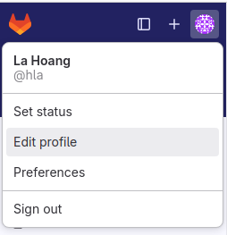
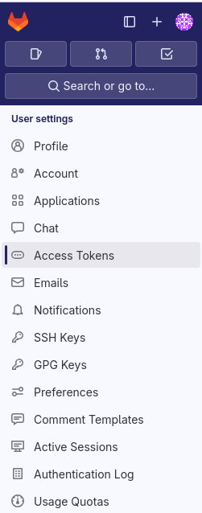
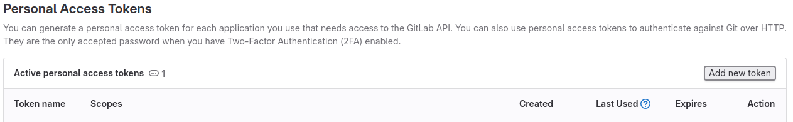
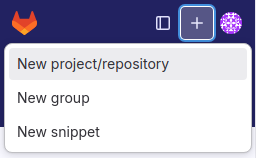
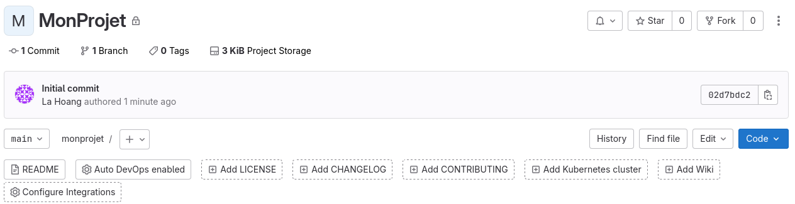
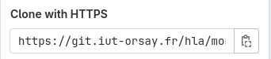
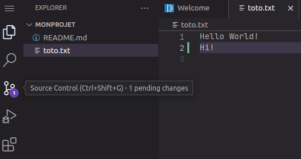
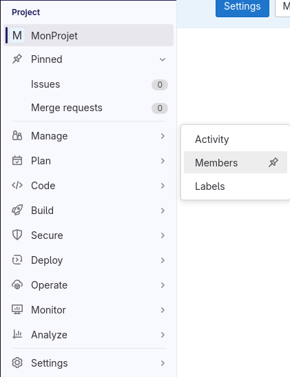

# TP1 : Découvrir Git et Gitlab

:::{note} Disclaimer
:class: dropdown
Le tutoriel est en Français mais il est fait avec un environnement en Anglais (avec des mots clés en Anglais comme *Edit*, *Create*, ...). C'est un choix mais aussi un conseil pour vous familiariser avec l'Anglais mais aussi le langage informatique de façon générale qui est universelle(ment en Anglais). 
:::

Avant de commencer à coder, il faut se familiariser avec les outils d'organisation de votre travail de programmation.

## Introduction à Git et GitLab

[Git](https://fr.wikipedia.org/wiki/Git) est un outil de [gestion des versions](https://fr.wikipedia.org/wiki/Gestion_de_versions). Il est déjà installé sur les machines du département. Si vous travaillez sur votre machine personnelle, vous pouvez l'[installer vous-même](https://git-scm.com/book/en/v2/Getting-Started-Installing-Git) gratuitement.


[GitLab](https://fr.wikipedia.org/wiki/GitLab) est une plateforme qui permet de stocker vos projets et de diffuser ce travail à tous vos postes (machine de l'IUT, machine personnelle) ainsi qu'à vos collaborateurs.

## Activation de votre compte GitLab

En tant qu'étudiant de l'IUT d'Orsay, vous avez déjà un compte sur le [GitLab de l'IUT](https://git.iut-orsay.fr/).

```{image} ../images/git-iut-orsay.jpg
:alt: git.iut-orsay.fr
:align: center
```

Pour vous authentifier, utilisez vos login et mot de passe du département.

## Personal Access Token

Pour établir une connection sécurisée entre votre machine et le serveur GitLab de l'IUT, nous allons utiliser un **Personal Access Token** (PAT).

Pour créer un PAT :
1. Aller dans votre profile en cliquant sur votre avatar (en haut à gauche) puis **Edit profile**[^edit_profile].
2. Choisir **Access Tokens**[^access_token_menu] dans la barre à gauche.
3. Ajouter un token en cliquant sur **Add new token**[^add_new_token].
4. Ajouter un nom et une date d'expiration d'un an (le maximum possible) après la date d'aujourd'hui.
5. Choisir tous les [scopes](https://docs.gitlab.com/ee/user/profile/personal_access_tokens.html#personal-access-token-scopes).
6. Cliquer sur **Create personal access token**.

:::{important} Sauvegarder votre PAT
Une fois que vous quittez la page de création, le PAT ne vous sera jamais rappelé.
:::

Vous pouvez créer autant de PAT que vous voulez (une par machine par exemple).

[^edit_profile]: 

[^access_token_menu]: 

[^add_new_token]: 

## Créer votre premier projet sur le dépôt distant

Vous pouvez maintenant créer votre premier projet/dépôt (*repository*)[^create_new_project] en cliquant sur `+` en haut à gauche.

[^create_new_project]: 

Créer un projet vide avec un nom pertinent.

:::{important} MonProjet
Dans la suite, nous allons appeler ce projet **MonProjet**. Il ne faut pas oublier de le remplacer avec le nom que vous avez choisi.
:::

Choisir le niveau de visibilité privé pour votre projet et l'option d'initialiser le projet avec un README.

:::{note} README.md
:class: dropdown
Avoir un README en [Markdown](https://fr.wikipedia.org/wiki/Markdown) dans un projet est une pratique standard. Ce README sert comme une description du projet.  
:::

Parcourir le README et regarder le README par défaut proposé par GitLab.

:::{important} Linux
Ce qui suit est fait pour Linux. Il faut adapter les commandes Unix pour Mac OS. Pour Windows, vous pouvez installer l'émulateur [Git for Windows](https://gitforwindows.org/) qui simule Git comme si vous étiez sous Linux. 
:::

## Configurer votre poste de travail local

Vous avez maintenant créer votre projet sur le dépôt distant sur le serveur de l'IUT. Maintenant, pour travailler sur ce projet sur votre machine (localement), il faut d'abord le configurer.

```{code} sh
git config --global user.name "Prénom Nom"
git config --global user.email "prenom.nom@universite-paris-saclay.fr"
```

Maintenant, vous pouver clôner votre dépôt distant pour le télécharger vers votre poste local :
- Cliquer sur le bouton **Code**[^code_button] à droite.
- Copier le code de l'option **Clone with HTTPS**[^clone_https].
- Ouvrir un terminal dans votre répertoire de travail.
- Taper la commande suivante (en collant l'adresse que vous aviez copié).

```{code} sh
git clone https://git.iut-orsay.fr/login/monprojet.git
```
[^code_button]: 

[^clone_https]: 

La commande `git clone` va vous demander un username et un mot de passe. Mettez votre username et pour le mot de passe, copier coller le PAT que vous avez créé et sauvegardé.

Pour ne pas avoir à rentrer le PAT à chaque interaction avec votre dépôt distant, vous pouvez configurer votre machine locale avec la commande suivante.

```{code} sh
git config --global credential.helper cache
```

## Travailler sur le dépôt local

Un répertoire portant le même nom (*dépôt local*) est maintenant téléchargé sur votre machine.

```{code} sh
cd monprojet/
ls
git status
```

`ls` vous permet de voir l'ensemble des fichiers dans le répertoire et `git status` montre l'état du dépôt. Pour l'instant, il devra vous indiquer qu'il n'y a rien à valider et votre copie du travail est propre (*nothing to commit, working tree clean*).

Qu'observez-vous en tapant les commandes suivantes ?

```{code} sh
 touch toto.txt
 git status
```
:::{hint} Fichier non suivi
:class: dropdown
Il indique que votre répertoire de travail contient un fichier **non suivi** (*untracked*). Git est un outil de versionnage : il vous permet de garder l'historique des changements des fichiers de votre projet mais pas tous les fichiers sont forcément importants. Donc, par défaut, les fichiers que vous créer ne sont pas suivi. Seul les fichiers suivis auront leur historique gardé.
:::

Ajouter une ligne dans `toto.txt` (par exemple `Hello World!`).

Demander à Git de suivre `toto.txt` en faisant:
```{code} sh
git add toto.txt
```

Vérifier `git status` encore une fois. Qu'est-ce qu'il vous indique ?

Nous avons parlé d'historique des changements du projet mais comment cela fonctionne-t-il exactement ? 

`git add` indique à Git que le fichier que vous avez ajouté est important (à suivre). Dans ce fichier, vous avez fait des modifications (en rajoutant `Hello World!` par exemple). Maintenant, pour créer un historique de `toto.txt`, vous devez sauvegarder ces changements.

```{code} sh
git commit -m "Création d'un fichier important pour mon travail"
```

Retaper `git status` pour vérifier l'état de votre dépôt. Qu'est-ce qu'il vous indique ?

:::{hint} Ready to push
:class: dropdown
La sauvegarde a été faite. Votre version locale du projet est en avance par rapport à la version sur le serveur GitLab. Vous pouvez donc diffuser ces changements pour synchroniser les deux versions.
:::

```{code} sh
git push
```

Retourner sur Gitlab et voyez que votre projet contient maintenant `toto.txt`.

## Travailler sur le dépôt distant

Avec le web IDE de GitLab, il est possible de travailler directement sur le dépôt distant.

Les changements que nous allons faire sur le dépôt distant vont simuler les changements fait par vous-même sur un autre poste de travail ou par un collaborateur de votre projet :
- Cliquer sur `toto.txt`.
- Cliquer sur **Edit**.
- Choisir l'option **Open in Web IDE**.
- Ajouter une deuxième ligne à ce fichier (par exemple `Hi!`).

Vous pouvez voir sur la barre à gauche un `1` indiquant un changement a été effectué[^pending_changes]. Si vous cliquez dessus, vous voyez un changement concernant le fichier `toto.txt` et l'option de sauvegarder sur la branche `main` (*Commit to 'main'*).

- Ajouter un message de commit et cliquer sur le bouton **Commit to 'main'**.
- Cliquer sur **Continue** quand on vous demande si vous voulez sauvegarder sur la branche par défaut (main).
:::{note} Branches
:class: dropdown
La notion de **branches** en Git permet de toujours garder une version stable d'une application/un projet. Toutes modifications sont donc faites sur d'autres branches que 'main' puis fusionnées avec la branche 'main' plus tard. Dans ce cours, nous n'allons pas aborder les branches en Git comme beaucoup d'autres utilités de Git que nous allons survoler. Les modifications sont donc faites directement sur 'main'.
:::

[^pending_changes]: 

## Synchronisation du dépôt local avec le dépôt distant

Remettez-vous sur votre dépôt local et oublions que nous avons fait des changements sur le dépôt distant.

:::{important} Commencer par synchroniser !
:class: dropdown
En pratique, quand vous travailler dans un projet, très souvent entre deux sessions de travail, quelqu'un d'autre a modifié un bout de code dans votre projet. Si vous commencer votre session de travail sans d'abord synchroniser votre code, vous allez vous faire face à des conflits à résoudre (par exemple si vous aller modifier les mêmes bouts de code de façons différentes). Nous allons survoler la résolution de conflits dans ce cours mais par principe, il faut l'éviter et donc toujours commencer par `git pull` !
:::

Pour synchroniser votre dépôt local avec le dépôt distant qui est cette fois celui en avance, vous devez faire :

```{code} sh
git pull
```
Vous pouvez aussi voir l'historique des commits en faisant :

```{code} sh
git log
```
Cela vous permet d'être au courant de l'évolution de votre projet.

## Ignorer les fichiers inintéressants

Lors du développement, il y a beaucoup de fichiers que l'on souhaite **ignorer** en permanence dans les sauvegardes (par exemple, les fichiers générés lors de la compilation) car ils polluent inutilement le dépôt. Cela peut aussi être source de problèmes quand vous récupérez des fichiers de configurations de certaines machines et que vous essayer de les synchroniser avec d'autres (problèmes de compatibilité).

La gestion de ces fichiers sont donc faites avec un fichier `.gitignore` qui est à la racine de votre projet. Dans ce fichier, vous pouvez ajouter tout ce que vous ne voulez pas suivre :
- Créer un fichier `tobeignored`.
- Créer un fichier `.gitignore`.
- Ajouter `tobeignored` dans `.gitignore`.
- Suivre, sauvegarder, et diffuser `.gitignore` sur le dépôt distant.

Maintenant, vérifier `git status`. Qu'est-ce qui change d'habitude ?

:::{hint} Où sont mes fichiers non suivis ?
:class: dropdown
Normalement, vu que nous n'avons pas suivi `tobeignored`, `git status` nous prévient en disant qu'il y a un fichier potentiellement important qui n'est pas suivi. Par contre, grâce au fichier `.gitignore`, Git se rend compte que nous avons fait le choix d'ignorer `tobeignored` et ne suivra jamais ce fichier.
:::

[Un exemple de `.gitignore`](https://github.com/github/gitignore/blob/main/Unity.gitignore) pour des projets plus complexes.


## Pour finir...

Finissons ce TP avec une petite réorganisation : créer un dossier TP1 dans votre projet et bouge `toto.txt` vers ce dossier. Vous allez maintenir ce projet pendant le reste du cours en créant des dossiers séparés pour chaque TP. Est-ce que vous êtes capable maintenant de faire `add`, `commit`, `push` vous-même ?

:::{important} À NE PAS OUBLIER !
Il faut ajouter votre intervenant dans votre projet !
- Cliquer sur **Manage** à gauche puis **Members**[^manage_members].
- Cliquer sur **Invite members** en haut à droite.
- Ajouter votre intervenant avec le rôle **Maintainer** (qui lui donne presque autant de droit sur le projet que vous l'**Owner**).
Si l'intervenant n'est pas sur votre projet, il ne pourra pas le noter et donc vous aurez 0 ! 
:::

[^manage_members]: 