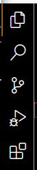

# TP4 : Découvrir un IDE

:::{important} QCM
:class: dropdown
Les réponses aux questions du TPs sont à remplir dans le QCM sur Moodle.
:::

## VSCodium

Ouvrir VSCodium sur Debian à l'IUT. 

:::{seealso} Sur votre machine personnelle.
:class: dropdown
Si vous travaillez sur votre machine personnelle, vous pouvez aller sur [le site de VSCodium](https://vscodium.com/#install) pour l'installer. C'est un logiciel complètement gratuit et open source.
:::

Pour avoir accès à Internet, changer le proxy avec l'aide du [soutien technique](#vscodium-proxy).

Ouvrir le dossier contenant votre projet. Sur l'écran vous devez avoir l'*Editor* et tout à gauche, une barre verticale[^left_sidebar] avec *Explorer*, *Search*, *Source Control*, *Run and Debug* et *Extensions*.
- **Editor** est un éditeur de texte de base avec de la coloration syntaxique. 
    - Cliquer sur le README généré par Git. Sur votre droite, vous devez voir une version miniature du code. Vous pouvez naviguer le code rapidement en cliquant directement sur la partie du code qui vous intéresse. 
    - En haut à droite, vous avez deux actions affichées, une qui permet de *Preview* le README (cette option existe pour les markdowns et permet de voir le rendu du fichier en temps réel). L'autre option permet de *Split* l'éditeur pour vous permettre d'avoir plusieurs fichiers ouverts en même temps. Vous pouvez faire du *Drag and Drop* de fichiers entre les deux fenêtres.
- **Explorer** est un outil de navigation à l'intérieur de votre projet. 
    - Vous pouvez créer des fichiers et des dossiers directement avec les shorcuts qui apparaissent quand la souris survole l'Explorer. Un clic droit vous donne aussi des options que vous retrouvez dans un navigateur classique.
    - En bas de la barre, vous avez **Outline** qui montre la structure du fichier (s'il y a une structure reconnue). Cliquer sur votre README pour voir un exemple.
    - Vous y retrouvez aussi **Timeline** qui montre l'historique des changements du fichier. En survolant les items du Timeline, vous devez voir l'auteur du commit, la date à laquelle le commit a été effectué, et le message du commit.
    Cliquer sur un fichier `.cpp` sur lequel vous avez travaillé. Vous devez voir aussi des changements locaux (*File saved*). Vous pouvez filtrer le Timeline pour faire afficher que l'historique de Git.
    Quand vous survolez un item de l'historique des commits, vous pouvez cliquer sur *View Commit*. Cette vue permet de voir les modifications qui ont été faites au fichier courant lors de ce commit. 
- **Search** est un outil de recherche à l'intérieur de votre projet.
    - Avec cet outil, vous pouvez retrouver des morceaux de code dans tous les fichiers de votre projet. Taper `get` dans la barre de recherche pour voir un exemple. Pour mieux repérer l'emplacement des fichiers, vous pouvez cliquer sur *View as Tree* en haut de la barre. Vous pouvez aussi cliquer sur *Open New Search Editor* pour voir tous les codes concernés.
    - À droite de la barre de recherche, vous avez différentes options. L'option *Match Whole Word* ne retourne que les résultats où `get` constitue tout le mot (au lieu des mots qui contiennent `get` par exemple).
    - L'option *Use Regular Expression* vous permet de faire une recherche de mots qui correspondent à votre expression régulière. Taper `get[a-z]` dans la barre de recherche et cliquer sur *Use Regular Expression*. Vous devez voir tous les `get` qui sont suivis de n'importe quelle lettre.
    - L'option *Match Case* recherche aussi à vérifier les majuscules et minuscules dans le mot. Cliquer sur *Match Case* et observer que `get[a-z]` retourne très peu de résultats : cette fois, les résultats retournés sont seulement les mots avec `get` suivi d'une lettre minuscule. Si vous changez `get[a-z]` en `get[A-Z]` alors vous devez voir beaucoup de résultats (si vous avez bien respecté la convention camelCase dans vos codes).
    - Sur la barre à gauche, vous voyez aussi l'option **Replace** qui permet de remplacer le mot cherché. Cette option peut être utile pour changer toutes les occurrences d'une variable par exemple. À droite, vous avez l'icône *Replace All* qui permet de remplacer dans tous les fichiers. Vous pouvez aussi cliquer sur l'icône *Replace* qui apparaît quand vous survolez un résultat. *Replace All* est aussi possible à l'intérieur d'un fichier donné.  
- **Source Control** est l'intégration Git dans VSCodium. Pour voir comment l'utiliser, **créer un dossier `TP4`** (en utilisant l'interface de l'IDE). À l'intérieur du dossier, **créer un fichier `hello-world.cpp`**.
    - Vous devez voir `1` apparaitre sur l'icône de *Source Control*. Si vous le survolez, c'est marqué *1 pending change(s)*. Il s'agit des changements qui ne sont pas encore *commité*. Dans *Explorer*, vous voyez aussi un point vert à côté du dossier `TP4` qui contient le nouveau fichier et à côté du fichier vous voyez un `U` qui est une abbréviation de **Untracked**. Cela indique que ce nouveau fichier n'a pas encore été suivi. Si vous modifiez un fichier existant, vous devez voir la lettre `M` en jaune qui est court pour **Modified** et qui indique aussi que cette modification n'a pas été suivie.
    - Cliquer sur *Source Control*. Vous devez voir les nouveaux changements du projet. Vous pouvez suivre le nouveau fichier `hello-world.cpp` en cliquant sur le `+` qui indique **Stage Changes**. Il y a deux catégories de changements qui apparaissent : **Staged Changes** et **Changes**. *Staged Changes* correspond aux changements qui sont suivis. Maintenant, dans *Explorer* vous devez voir la lettre `A` apparaitre à côté de `hello-world.cpp` qui est une abbréviation de **Added**.
    - Écrire un message de commit dans la barre **Message**. Cliquer sur **Commit**. Vous voyez apparaitre **Outgoing** et la branche **main**, ce qui indique que ces changements vont être effectués sur la branche *main*. Si vous cliquez sur le *Drop Down* à côté de *main*, vous devez voir l'entrée dans le *Timeline* correspondant à votre commit. Vous pouvez maintenant cliquer sur **Sync Changes** qui va synchroniser (pull puis push) votre dépôt local avec le dépôt distant.
- **Run and Debug** sera étudié au TP suivant.
- **Extensions** permet d'ajouter des extensions qui rajoutent des fonctionnalités à notre IDE.

[^left_sidebar]: 


Dans `hello-world.cpp`, écrire un code qui permet d'afficher `Hello World!` dans le terminal. Vous pouvez observer que des options d'autocomplétion vous sont proposées quand vous coder. L'autocomplétion est assez pratique pour éviter des erreurs en tapant des noms de variables/fonctions existantes.

Cliquer droit sur le dossier `TP4` et choisir **Open in Integrated Terminal**. Vous devez voir apparaître un terminal en bas de l'écran. Comme d'habitude, vous pouvez toujours travailler directement dans le terminal que ce soit pour compiler, éxécuter ou pour utiliser Git.

Compiler `hello-world.cpp` et nommer l'exécutable `hello-world.exe`. 

:::{important} .gitignore
:class: dropdown
Vous devez voir apparaître l'éxécutable dans *Explorer* avec un `U`. À partir de maintenant, on ne va plus modifier `.gitignore` à chaque fois que l'on rajoute un exécutable (avant c'était pour vous rappeler de l'utilité de .gitignore). À la place, on va nommer tous les exécutables avec une extension `.exe` (comme `hello-world.exe`) et on va ignorer tous les fichiers avec l'extension `.exe` à l'intérieur des dossiers des TPs en rajoutant `/*/*.exe` à `.gitignore`. Enregistrer le changement et observer que le `U` à côté de `hello-world.exe` a disparu, cela indique que ce fichier a été ignoré par Git.
:::

### Extension for cpp
### Résolution des conflits

## Exercice : Commenter et Documenter

Améliorer le code suivant (sans faire le TODO).

```{code} cpp
/*
Copyright 2024, Université Paris-Saclay

Permission is hereby granted, free of charge, to any 
person obtaining a copy of this software and associated 
documentation files (the “Software”), to deal in the 
Software without restriction, including without 
limitation the rights to use, copy, modify, merge, 
publish, distribute, sublicense, and/or sell copies of 
the Software, and to permit persons to whom the Software 
is furnished to do so, subject to the following 
conditions:

The above copyright notice and this permission notice 
shall be included in all copies or substantial portions 
of the Software.

THE SOFTWARE IS PROVIDED “AS IS”, WITHOUT WARRANTY OF ANY 
KIND, EXPRESS OR IMPLIED, INCLUDING BUT NOT LIMITED TO 
THE WARRANTIES OF MERCHANTABILITY, FITNESS FOR A 
PARTICULAR PURPOSE AND NONINFRINGEMENT. IN NO EVENT SHALL 
THE AUTHORS OR COPYRIGHT HOLDERS BE LIABLE FOR ANY CLAIM, 
DAMAGES OR OTHER LIABILITY, WHETHER IN AN ACTION OF 
CONTRACT, TORT OR OTHERWISE, ARISING FROM, OUT OF OR IN 
CONNECTION WITH THE SOFTWARE OR THE USE OR OTHER DEALINGS 
IN THE SOFTWARE.
*/
#include <cmath>
#include <vector>

using namespace std;

class PrimeGenerator {
public:
/*
Generate the primes up to the given parameter.

generatePrimes uses the sieve of Erastosthenes whose 
general idea is to remove the multiples of each interger 
successively and the remaining ones must be the primes. 

Parameters:
    - maxValue: the upper limit of integers that will be 
    checked

Returns:
    Primes between 2 and maxValue.
*/
    vector<int> generatePrimes(int maxValue) {
        if (maxValue < 2)
            return vector<int>();
        else {
            init(maxValue); // initialize by uncrossing integers up to maxValue
            sieve(); // cross out all the multiples
            result(); // put uncrossed integers into result
            return result;
        }
    }
    
private:
    vector<bool> crossedOut;
    // vector was chosen for result instead a simple
    // array since the number of primes before maxValue
    // is variable and hard to compute
    vector<int> result; 

    // initialize by uncrossing integers up to maxValue 
    void init(int maxValue) {
        crossedOut = vector<bool>(maxValue + 1, false);
    }

    // cross out all the multiples
    void sieve() {
        int limit = determineIterationLimit();
        for (int i = 2; i <= limit; i++)
            if (!crossedOut[i])
                crossOutMultiplesOf(i);
    }

    // It suffices to check the multiples of numbers
    // less than sqrt(crossedOut.size()) because every
    // number has a prime factor in this range
    int determineIterationLimit() {
        double iterationLimit = sqrt(crossedOut.size());
        // cout << iterationLimit << endl;
        return floor(iterationLimit);
    }

    // cross out multiples of i
    void crossOutMultiplesOf(int i) {
        for (int multiple = 2 * i; multiple < crossedOut.size(); multiple += i)
            crossedOut[multiple] = true;
    }

    // TODO: for every integer that is not crossed 
    // out, push it into result.
    void result() {
    
    }
};
```

### QCM
1. Le Timeline contient un journal de commit pour un fichier particulier, quelle commande Git permet d'afficher le "Timeline de tous les fichiers" ?
- git timeline
- git log (ok)
- git journal
- git history

2. Quelle est la signification de `U` ?
[] Le fichier correspondant n'est pas suivi. (ok)
[] Le fichier correspondant est nouveau. (ok)
[] Untracked. (ok)
[] Le fichier correspondant est ignoré.


3. Quelle est la signification de `M` ?
[] Le fichier correspondant n'est pas suivi. (ok)
[] Le fichier correspondant est nouveau.
[] Modified. (ok)
[] Modded.

4. À quelle commande correspond Stage Changes (le `+` à côté d'un fichier dans Source Control) ?
- git add (ok)
- git add .
- git stage
- git pull

5. Quelle est la signification de `A` ?
[] Added. (ok)
[] Les changements du fichier correspondant sont suivis. (ok)
[] The file changes are staged. (ok)
[] Les changements du fichier correspondant sont rajoutés au dépôt distant.

6. Quelle est la différence entre Changes et Staged Changes dans Source Control ?
- Changes correspond à tous les changements et Staged Changes correspond seulement aux changements suivis.
- Changes correspond aux changements suivis et Staged Changes correspond aux changements non suivis.
- Changes correspond aux changements non suivis et Staged Changes correspond aux changements suivis. (ok)

7. Le message de Commit est une entrée dans le journal pour quels changements ?
- Changes.
- Staged Changes. (ok)
- Tous les changements.

8. Est-ce que vous pouvez faire un Commit sans message ?
- Oui.
- Non. (ok)

9. Il y a un Drop Down Menu à côté de Commit qui propose Commit & Sync et Commit & Push. Quelle est la différence entre les deux ?
[] Sync effectue un git pull puis un git push. (ok)
[] Sync synchronise les dépôts local et distant. (ok)
[] Push diffuse les changements locaux sur le dépôt distant. (ok)
[] Sync effectue un git pull alors que Push effectue un git push.

10. Combien d'éléments sont manquant dans la documentation de generatePrimes ?
- 0
- 1
- 2 (ok)

11. Combien de blocs de commentaires avez vous dans votre code amélioré ?
- 4