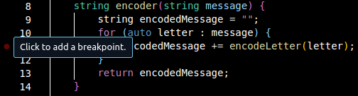
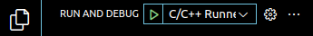

# TP5 : Débugger et gestion des erreurs

:::{important} QCM
:class: dropdown
Les réponses aux questions du TPs sont à remplir dans le QCM sur Moodle.
:::

## Exercice 1 : Code à débugger

Recopier le code suivant.

```{code} cpp
#include <iostream>
#include <string>

using namespace std;

class cesarEncoding {
public:
    string encoder(string message) {
        string encodedMessage = "";
        for (auto letter : message) {
            encodedMessage += encodeLetter(letter);
        }
        return encodedMessage;
    }

private:
    int mKey = 3;

    char encodeLetter(char letter) {
        letter += mKey;
        return letter;
    }
};

int main() {
    string message = "A message to encode";
    cesarEncoding encoding;
    cout << encoding.encoder(message) << endl;
    return 0;
}
```

Pour comprendre ce que fait ce code, nous allons utiliser le mode **Run and Debug** de VSCodium.

Avant de commencer, rendez-vous sur [le tutoriel pour le setup du Debugger de *C/C++ Runner*](#vscodium-debugger) et suivre ses instructions.

Maintenant, compiler le code avec `Ctrl+Alt+B`.

:::{warning} `launch.json`
Vérifier le fichier `launch.json` dans le dossier `.vscode`. **Si en face de `type`, vous voye*z toujours `gdb` alors il faut le changer en `lldb`.** 

Le changement du template doit vous permettre de ne pas à avoir rechanger `launch.json` à chaque compilation. Si vous avez encore une erreur quand vous faites tourner **Run and Debug**, alors il faut vérifier `launch.json` et vous avez probablement mal fait la manipulation du template dans [le tutoriel](#vscodium-debuuger).
:::

Nous allons ajouter un **breakpoint** à la ligne 15 correspondant au code `encodedMessage += encodeLetter(letter);`[^breakpoint].

[^breakpoint]: 

Cliquer sur le bouton vert **Start Debugging** à côté de *RUN AND DEBUG** [^start_debugging] ou appuyer sur le shortcut **F5**.

[^start_debugging]: 

Vous allez voir apparaître à gauche les différentes **VARIABLES** donc vous avez accès à l'intérieur de la fonction `encoder`.

**Question 1** : Quelles sont ces variables ?

Vous pouvez connaître le type de ces variables en mettant la souris par dessus le nom de la variable.

**Question 2** : Quel est le type de `letter` ici ?

L'exécution du programme est maintenant en pause, vous pouvez contrôler cette exécution grâce à la barre de debug[^debug_bar].
- Le bouton **Continue** (F5) permet de continuer l'exécution qui se remettra en pause quand elle retombera sur le breakpoint. Cliquer sur *Continue* 3 fois.

**Question 3** : Quelle est la valeur de `encodedMessage` (avec les guillemets) ?

- Le bouton **Step Over** (F10) permet de continuer l'exécution instruction par instruction.

**Question 4** : Utiliser *Step Over* pour déduire la valeur de `encodeLetter(letter)` quand `letter: 's'`. Quelle est cette valeur ?

- Le bouton **Step Into** (F11) permet de rentrer dans l'exécution ligne par ligne des (sous-)fonctions appellées (contrairement à *Step Over* qui exécute `encodeLetter(letter)` comme une seule instruction). Cliquer sur *Step Into* jusqu'à ce que vous rentrez dans l'itérateur `auto letter : message`. Vous allez tomber sur un autre fichier de code.

**Question 5** : Quel est le nom de ce fichier (avec l'extension) ?

- Le bouton **Step Out** (Shift+F11) permet de sortir de la sous-fonction que l'on a *Stepped Into*. Sortir de ce fichier pour revenir sur notre code.
- Le bouton **Restart** (Ctrl+Shift+F5) permet de recommencer l'exécution.
- Le bouton **Stop** (Shift+F5) permet d'arrêter l'exécution.

Sur votre gauche, vous pouvez voir une catégorie **WATCH**. Ici, on peut ajouter des expressions calculées à partir des variables qui sont disponibles dans *VARIABLES*. Ajouter l'expression `letter+mKey` dans *WATCH* grâce à `+` (*Add Expression*).

**Question 6** : Quelle est le type de `letter+mKey` dans *WATCH* ?

Les breakpoints marquent des pauses dans l'exécution du programme. Il est possible de rendre ces pauses conditionnelles car on n'a pas toujours envie d'appuyer sur *Continue* jusqu'à ce que l'exécution du programme arrive au moment qui nous intéresse. Il y a plusieurs conditions possibles que l'on peut rajouter à un breakpoint : cliquer droit sur le breakpoint puis **Edit Breakpoint...**. Il y a un *Menu Drop Down* avec plusieurs options.
- **Expression** permet d'ajouter une condition. L'exécution se mettra en pause à ce breakpoint seulement quand la condition est évaluée à vraie. Utiliser *Expression* pour mettre une pause à l'exécution quand `letter+mKey == 119`.

**Question 7** : Quelle est la valeur de encodedMessage quand `letter+mKey == 119` ?

- **Hit Count** est un nombre $n$ qui permet d'activer le breakpoint un fois que l'exécution passe par ce breakpoint $n$ fois. 

[^debug_bar]: 

Vous pouvez regarder la [documentation du debugger](https://code.visualstudio.com/docs/editor/debugging) pour plus d'informations.

<!-- ## Exercice 2 : Try Throw Catch

```{code} cpp

```

## Exercice 3 : Special Case Pattern

```{code} java

``` -->