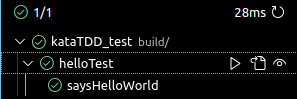

# TP6 : Tests Driven Development

:::{important} QCM
:class: dropdown
Ne pas oublier de répondre au QCM sur Moodle.
:::

## CMake et Google Test

Avant de commencer à coder, il faut configurer notre projet. Jusqu'à maintenant, nous avons travaillé que sur des mini-projets avec un seul fichier de code. Pour des projets plus complexes (dont les projets qui incluent des tests unitaires par exemple), il est préférable d'utiliser un "makefile" (ensemble d'instructions de compilation pour un projet).

Pour C++, nous allons utiliser **CMake**. Aller dans Extension et **télécharger CMake**. Vous pouvez aussi **télécharger C++ TestMate** pour un affichage plus compréhensible dans VSCodium des tests unitaires que nous allons écrire. 

Créer un dossier **TP6** dans lequel vous allez **ajouter deux fichiers `kataTDD.cpp` et `kataTDD_test.cpp`**.

Dans `kataTDD.cpp`, nous allons écrire une simple fonction qui retourne `Hello World!` :
```{code} cpp
using namespace std;

string hello() {
  return "Hello World!";
}
```

Dans `kataTDD_test.cpp`, nous allons écrire un test simple qui vérifie si la fonction `hello` retourne bien `Hello World!` en utilisant le framework **Google Test** :
```{code} cpp
#include <gtest/gtest.h>
#include "kataTDD.cpp"

TEST(helloTest, saysHelloWorld) {
  EXPECT_EQ(hello(),"Hello World!");
}
```

Maintenant, nous pouvons construire notre projet en incluant les tests unitaires que nous venons d'écrire. **Créer un fichier `CMakeLists.txt` dans `monprojet`** (et non pas dans `TP6`, votre fichier `CMakeLists.txt` doit être au même niveau que `README.md` et `.gitignore`).

Recopier le code suivant dans `CMakeLists.txt`.
```{code} cpp
cmake_minimum_required(VERSION 3.14)
project(monprojet) # Remplacer par le nom de votre projet : par exemple qualite-dev-s2-prenom-nom

set(CMAKE_CXX_STANDARD 14)
set(CMAKE_CXX_STANDARD_REQUIRED ON)

include(FetchContent)
FetchContent_Declare(
  googletest
  URL https://github.com/google/googletest/archive/03597a01ee50ed33e9dfd640b249b4be3799d395.zip
)

set(gtest_force_shared_crt ON CACHE BOOL "" FORCE)
FetchContent_MakeAvailable(googletest)

enable_testing()

add_executable(
  kataTDD_test
  ./TP6/kataTDD_test.cpp
)
target_link_libraries(
  kataTDD_test
  GTest::gtest_main
)

include(GoogleTest)
gtest_discover_tests(kataTDD_test)
```

Ouvrir un terminal avec un clic droit sur `CMakeLists.txt` puis *Open in Integrated Terminal*.

Compiler le projet avec les commandes suivantes.
```{code} sh
cmake -S . -B build
cmake --build build
```

:::{important} .gitignore
;class: dropdown
Corriger votre [.gitignore](#tp4-gitignore).
:::

Avec *C++ TestMate*, vous devez voir un onglet **Testing** dans la barre à gauche. Cliquer sur *Testing*. Vous devez voir les tests unitaires et vous pouvez les faire tourner[^testing].

[^testing]: 

Le test passe normalement. Maintenant, voyons ce qui se passe quand un test échoue.
- Enlever l'espace dans `"Hello World!"` dans le test `saysHelloWorld`.
- Recompiler avec `cmake --build build`.
- Refaire tourner le test `saysHelloWorld`.
- Le test ne doit pas passer et vous devez obtenir le message suivant qui indique qu'il s'attend à ce que `hello()` et `"HelloWorld!"` soient égaux alors que `hello()` a retourné `"Hello World!"`.
```{code}
# Failure:
Expected equality of these values:
  hello()
    Which is: "Hello World!"
  "HelloWorld!"
```

Vous pouvez maintenant rajouter l'espace dans `"HelloWorld!"`, recompiler et refaire passer le test.

:::{warning} Problème de syntaxe de Google Test avec la convention snake_case
:class: dropdown
Dans ce cours, nous avons adopté la convention camelCase. Dans d'autres cours/projet, vous pouvez aussi utiliser la convention snake_case qui sépare les mots avec des `_` au lieu des majuscules. 

Par contre, si vous utilisez Google Test, il ne faut absolument pas utiliser des `_` dans le nom des tests.
:::

<!-- ### Assertions

Il y a deux mots clés qu'il faut connaître : `ASSERT` et `EXPECT`.

Observer la différence entre `ASSERT` et `EXPECT` grâce aux tests suivants qui doivent échouer.

```{code} cpp
TEST(helloTest, saysHelloWorldWithAssert) {
  ASSERT_EQ(hello(),"Hello!");
  EXPECT_EQ(hello(),"HelloWorld!");
}

TEST(helloTest, saysHelloWorldWithExpect) {
  EXPECT_EQ(hello(),"Hello!");
  EXPECT_EQ(hello(),"HelloWorld!");
}
```

**Question 1** : Quelle est la différence entre `ASSERT` et `EXPECT` ?

Maintenant, vous pouvez supprimer ces tests qui échouent ou les modifier pour les faire passer.

Tester les mots clés suivants : 
- `EXPECT_TRUE(condition)`
- `EXPECT_FALSE(condition)`
- `EXPECT_EQ(firstValue, secondValue)`
- `EXPECT_NE(firstValue, secondValue)`
- `EXPECT_LT(firstValue, secondValue)`
- `EXPECT_LE(firstValue, secondValue)`
- `EXPECT_GT(firstValue, secondValue)`
- `EXPECT_GE(firstValue, secondValue)`
Les mêmes mots-clés existent avec `ASSERT` au lieu de `EXPECT`.

**Question 2** : Quelle est la signification de ces mots-clés ?

### Tests -->

Vous pouvez regarder [la documentation de Google Test](https://google.github.io/googletest/) pour plus d'informations sur la syntaxe de Google Test.

## TDD

Nous allons utiliser le TDD pour écrire une fonction qui prend une chiffre romain en entrée et qui retourne le nombre correspondant en décimal.

Ajouter le code suivant à votre fichier `kataTDD.cpp`.
```{code} cpp
#include <unordered_map>
#include <stdexcept>

class RomanToDecimal {
public:
  RomanToDecimal(string romanNumeral) : mRomanNumeral(romanNumeral) {}

  int getDecimal() {}

private:
  string mRomanNumeral;
  unordered_map<string, int> romanLetters;
  int decimal = 0;
};
```

Les lettres romaines :
| I | V | X  | L  |  C  |  D  |  M   |
|---|---|----|----|-----|-----|------|
| 1 | 5 | 10 | 50 | 100 | 500 | 1000 |

Un nombre romain se lit de gauche à droite en faisant des additions et des soustractions des valeurs des chiffres. Tout symbole qui suit un symbole de valeur supérieure ou égale s’ajoute à celui-ci (exemple : 6 s'écrit `VI`). Tout symbole qui précède un symbole de valeur supérieure se soustrait à ce dernier (exemple : 40 s'écrit `XL`). Par exemple le nombre romain `MLXIII` correspond à 1063 dans la numérotation décimale car il se décompose comme `M`+`L`+`X`+`I`+`I`+`I` = 1000+50+10+1+1+1. Alors que le nombre `XXXIV` vaut 34 car il se décompose comme `X`+`X`+`X`+`IV`=10+10+10+4. Une meilleure façon de voir ce dernier exemple c'est d'utiliser la soustraction `X`+`X`+`X`-`I`+`V`=10+10+10-1+5.

On va se fixer une représentation unique des nombres romains avec les principes suivants :
- Un même symbole n'est pas employé quatre fois de suite (sauf `M`).
- Les soustractions s'effectuent sur un seul symbole (par exemple `XL` est correct et vaut 40, mais il est interdit d'écrire `XXL` pour 30, et on écrira plutôt `XXX`).
- On écrira en respectant l'ordre suivant
  - d'abord les chiffres des milliers (à l'aide uniquement de `M`)
  - puis les chiffres des centaines (à l'aide uniquement de `C`,`D`,`M`)
  - puis les chiffres des dizaines (à l'aide uniquement de `X`,`L`,`C`)
  - puis les chiffres des unités (à l'aide uniquement de `I`,`V`,`X`)
- Pour chacune des 4 étapes ci-dessus, on utilisera le moins de symboles possible.

Par exemple :
- `IL` (pour 49) est interdit (I n'est pas autorisé pour décrire les dizaines), et 49 = `XLIX`
- `XCM` est interdit (car que l'on interprète comme `X` `CM` ou `XC` `M`, cela ne respecte pas l'ordre ci-dessus)
- `VX` (pour 5) est interdit, car `V` utilise moins de symboles
- `XCXX` (pour 110) est interdit, car il faut décrire le chiffre des centaines avec `C`,`D`, `M`.

:::{important} TDD
:class: dropdown
Faites très attention pour cet exercice de bien respecter le principe du TDD en ajoutant vraiment tout le temps la quantité minimale de code nécessaire à la validation des tests. Si vous suivez cette règle, il se résout très facilement alors qu'en l'abordant de manière générale, il comporte de nombreux pièges pouvant vous faire perdre un temps précieux.
:::

Dans cet exercice, vous allez manipuler la classe [`string`](https://en.cppreference.com/w/cpp/string/basic_string) et [`unordered_map`](https://en.cppreference.com/w/cpp/container/unordered_map).

**Question 1** : Que fait `s.length()` ?

**Question 2** : Que fait `s.substr(i,2)` ?

**Question 3** : Quelle est la syntaxe de `unordered_map` ?

**Question 4** : Comment accéder à un élément de `unordered_map<string,int>` ?

**Question 5** : Comment vérifier qu'un élément n'est pas dans `unordered_map` avec `find` ?

1. Commencer par écrire un test qui échoue quand on rentre une string qui n'est pas un nombre romain.
```{code} cpp
TEST(RomanToDecimalTest, IMShouldFail) {
  RomanToDecimal romanNumeral("IM");
  EXPECT_NO_FATAL_FAILURE(romanNumeral.getDecimal());
}
```

2. Pour passer ce test, il faut écrire un gestionnaire d'erreur.

3. Écrire un test pour les lettres romains (I, V, X, L, C, D, M).

4. Passer le test en remplissant `romanLetters`.

5. Écrire un test pour des nombres qui nécessitent pas de soustractions.

6. Passer ce test.

7. Écrire un tests pour des nombres à deux lettres qui nécessitent une soustraction.

8. Passer ce test.

9. Écrire un tests pour des faux nombres à deux lettres (avec `EXPECT_NO_FATAL_FAILURE`).

10. Passer ce test en levant un erreur.

11. Refactoriser en rajoutant à `romanLetters` les paires de lettres autorisées quand on détecte une soustraction à faire (IV, IX, XL, XC, CD, CM).

12. Écrire d'autres tests et essayer de les passer jusqu'à ce que vous obtenez un code qui fonctionne.

Pour vous aider, voici un tableau avec tous les nombres romains entre 1 et 1000 :
```{code} cpp
vector<string> values = {"I", "II", "III", "IV", "V", "VI", "VII", "VIII", "IX", "X", "XI", "XII", "XIII", "XIV",
  "XV", "XVI", "XVII", "XVIII", "XIX", "XX", "XXI", "XXII", "XXIII", "XXIV", "XXV", "XXVI", "XXVII",
  "XXVIII", "XXIX", "XXX", "XXXI", "XXXII", "XXXIII", "XXXIV", "XXXV", "XXXVI", "XXXVII", "XXXVIII",
  "XXXIX", "XL", "XLI", "XLII", "XLIII", "XLIV", "XLV", "XLVI", "XLVII", "XLVIII", "XLIX", "L", "LI",
  "LII", "LIII", "LIV", "LV", "LVI", "LVII", "LVIII", "LIX", "LX", "LXI", "LXII", "LXIII", "LXIV", "LXV",
  "LXVI", "LXVII", "LXVIII", "LXIX", "LXX", "LXXI", "LXXII", "LXXIII", "LXXIV", "LXXV", "LXXVI", "LXXVII",
  "LXXVIII", "LXXIX", "LXXX", "LXXXI", "LXXXII", "LXXXIII", "LXXXIV", "LXXXV", "LXXXVI", "LXXXVII",
  "LXXXVIII", "LXXXIX", "XC", "XCI", "XCII", "XCIII", "XCIV", "XCV", "XCVI", "XCVII", "XCVIII", "XCIX",
  "C", "CI", "CII", "CIII", "CIV", "CV", "CVI", "CVII", "CVIII", "CIX", "CX", "CXI", "CXII", "CXIII",
  "CXIV", "CXV", "CXVI", "CXVII", "CXVIII", "CXIX", "CXX", "CXXI", "CXXII", "CXXIII", "CXXIV", "CXXV",
  "CXXVI", "CXXVII", "CXXVIII", "CXXIX", "CXXX", "CXXXI", "CXXXII", "CXXXIII", "CXXXIV", "CXXXV",
  "CXXXVI", "CXXXVII", "CXXXVIII", "CXXXIX", "CXL", "CXLI", "CXLII", "CXLIII", "CXLIV", "CXLV", "CXLVI",
  "CXLVII", "CXLVIII", "CXLIX", "CL", "CLI", "CLII", "CLIII", "CLIV", "CLV", "CLVI", "CLVII", "CLVIII",
  "CLIX", "CLX", "CLXI", "CLXII", "CLXIII", "CLXIV", "CLXV", "CLXVI", "CLXVII", "CLXVIII", "CLXIX",
  "CLXX", "CLXXI", "CLXXII", "CLXXIII", "CLXXIV", "CLXXV", "CLXXVI", "CLXXVII", "CLXXVIII", "CLXXIX",
  "CLXXX", "CLXXXI", "CLXXXII", "CLXXXIII", "CLXXXIV", "CLXXXV", "CLXXXVI", "CLXXXVII", "CLXXXVIII",
  "CLXXXIX", "CXC", "CXCI", "CXCII", "CXCIII", "CXCIV", "CXCV", "CXCVI", "CXCVII", "CXCVIII", "CXCIX",
  "CC", "CCI", "CCII", "CCIII", "CCIV", "CCV", "CCVI", "CCVII", "CCVIII", "CCIX", "CCX", "CCXI", "CCXII",
  "CCXIII", "CCXIV", "CCXV", "CCXVI", "CCXVII", "CCXVIII", "CCXIX", "CCXX", "CCXXI", "CCXXII", "CCXXIII",
  "CCXXIV", "CCXXV", "CCXXVI", "CCXXVII", "CCXXVIII", "CCXXIX", "CCXXX", "CCXXXI", "CCXXXII", "CCXXXIII",
  "CCXXXIV", "CCXXXV", "CCXXXVI", "CCXXXVII", "CCXXXVIII", "CCXXXIX", "CCXL", "CCXLI", "CCXLII",
  "CCXLIII", "CCXLIV", "CCXLV", "CCXLVI", "CCXLVII", "CCXLVIII", "CCXLIX", "CCL", "CCLI", "CCLII",
  "CCLIII", "CCLIV", "CCLV", "CCLVI", "CCLVII", "CCLVIII", "CCLIX", "CCLX", "CCLXI", "CCLXII", "CCLXIII",
  "CCLXIV", "CCLXV", "CCLXVI", "CCLXVII", "CCLXVIII", "CCLXIX", "CCLXX", "CCLXXI", "CCLXXII", "CCLXXIII",
  "CCLXXIV", "CCLXXV", "CCLXXVI", "CCLXXVII", "CCLXXVIII", "CCLXXIX", "CCLXXX", "CCLXXXI", "CCLXXXII",
  "CCLXXXIII", "CCLXXXIV", "CCLXXXV", "CCLXXXVI", "CCLXXXVII", "CCLXXXVIII", "CCLXXXIX", "CCXC", "CCXCI",
  "CCXCII", "CCXCIII", "CCXCIV", "CCXCV", "CCXCVI", "CCXCVII", "CCXCVIII", "CCXCIX", "CCC", "CCCI",
  "CCCII", "CCCIII", "CCCIV", "CCCV", "CCCVI", "CCCVII", "CCCVIII", "CCCIX", "CCCX", "CCCXI", "CCCXII",
  "CCCXIII", "CCCXIV", "CCCXV", "CCCXVI", "CCCXVII", "CCCXVIII", "CCCXIX", "CCCXX", "CCCXXI", "CCCXXII",
  "CCCXXIII", "CCCXXIV", "CCCXXV", "CCCXXVI", "CCCXXVII", "CCCXXVIII", "CCCXXIX", "CCCXXX", "CCCXXXI",
  "CCCXXXII", "CCCXXXIII", "CCCXXXIV", "CCCXXXV", "CCCXXXVI", "CCCXXXVII", "CCCXXXVIII", "CCCXXXIX",
  "CCCXL", "CCCXLI", "CCCXLII", "CCCXLIII", "CCCXLIV", "CCCXLV", "CCCXLVI", "CCCXLVII", "CCCXLVIII",
  "CCCXLIX", "CCCL", "CCCLI", "CCCLII", "CCCLIII", "CCCLIV", "CCCLV", "CCCLVI", "CCCLVII", "CCCLVIII",
  "CCCLIX", "CCCLX", "CCCLXI", "CCCLXII", "CCCLXIII", "CCCLXIV", "CCCLXV", "CCCLXVI", "CCCLXVII",
  "CCCLXVIII", "CCCLXIX", "CCCLXX", "CCCLXXI", "CCCLXXII", "CCCLXXIII", "CCCLXXIV", "CCCLXXV", "CCCLXXVI",
  "CCCLXXVII", "CCCLXXVIII", "CCCLXXIX", "CCCLXXX", "CCCLXXXI", "CCCLXXXII", "CCCLXXXIII", "CCCLXXXIV",
  "CCCLXXXV", "CCCLXXXVI", "CCCLXXXVII", "CCCLXXXVIII", "CCCLXXXIX", "CCCXC", "CCCXCI", "CCCXCII",
  "CCCXCIII", "CCCXCIV", "CCCXCV", "CCCXCVI", "CCCXCVII", "CCCXCVIII", "CCCXCIX", "CD", "CDI", "CDII",
  "CDIII", "CDIV", "CDV", "CDVI", "CDVII", "CDVIII", "CDIX", "CDX", "CDXI", "CDXII", "CDXIII", "CDXIV",
  "CDXV", "CDXVI", "CDXVII", "CDXVIII", "CDXIX", "CDXX", "CDXXI", "CDXXII", "CDXXIII", "CDXXIV", "CDXXV",
  "CDXXVI", "CDXXVII", "CDXXVIII", "CDXXIX", "CDXXX", "CDXXXI", "CDXXXII", "CDXXXIII", "CDXXXIV",
  "CDXXXV", "CDXXXVI", "CDXXXVII", "CDXXXVIII", "CDXXXIX", "CDXL", "CDXLI", "CDXLII", "CDXLIII", "CDXLIV",
  "CDXLV", "CDXLVI", "CDXLVII", "CDXLVIII", "CDXLIX", "CDL", "CDLI", "CDLII", "CDLIII", "CDLIV", "CDLV",
  "CDLVI", "CDLVII", "CDLVIII", "CDLIX", "CDLX", "CDLXI", "CDLXII", "CDLXIII", "CDLXIV", "CDLXV",
  "CDLXVI", "CDLXVII", "CDLXVIII", "CDLXIX", "CDLXX", "CDLXXI", "CDLXXII", "CDLXXIII", "CDLXXIV",
  "CDLXXV", "CDLXXVI", "CDLXXVII", "CDLXXVIII", "CDLXXIX", "CDLXXX", "CDLXXXI", "CDLXXXII", "CDLXXXIII",
  "CDLXXXIV", "CDLXXXV", "CDLXXXVI", "CDLXXXVII", "CDLXXXVIII", "CDLXXXIX", "CDXC", "CDXCI", "CDXCII",
  "CDXCIII", "CDXCIV", "CDXCV", "CDXCVI", "CDXCVII", "CDXCVIII", "CDXCIX", "D", "DI", "DII", "DIII",
  "DIV", "DV", "DVI", "DVII", "DVIII", "DIX", "DX", "DXI", "DXII", "DXIII", "DXIV", "DXV", "DXVI",
  "DXVII", "DXVIII", "DXIX", "DXX", "DXXI", "DXXII", "DXXIII", "DXXIV", "DXXV", "DXXVI", "DXXVII",
  "DXXVIII", "DXXIX", "DXXX", "DXXXI", "DXXXII", "DXXXIII", "DXXXIV", "DXXXV", "DXXXVI", "DXXXVII",
  "DXXXVIII", "DXXXIX", "DXL", "DXLI", "DXLII", "DXLIII", "DXLIV", "DXLV", "DXLVI", "DXLVII", "DXLVIII",
  "DXLIX", "DL", "DLI", "DLII", "DLIII", "DLIV", "DLV", "DLVI", "DLVII", "DLVIII", "DLIX", "DLX", "DLXI",
  "DLXII", "DLXIII", "DLXIV", "DLXV", "DLXVI", "DLXVII", "DLXVIII", "DLXIX", "DLXX", "DLXXI", "DLXXII",
  "DLXXIII", "DLXXIV", "DLXXV", "DLXXVI", "DLXXVII", "DLXXVIII", "DLXXIX", "DLXXX", "DLXXXI", "DLXXXII",
  "DLXXXIII", "DLXXXIV", "DLXXXV", "DLXXXVI", "DLXXXVII", "DLXXXVIII", "DLXXXIX", "DXC", "DXCI", "DXCII",
  "DXCIII", "DXCIV", "DXCV", "DXCVI", "DXCVII", "DXCVIII", "DXCIX", "DC", "DCI", "DCII", "DCIII", "DCIV",
  "DCV", "DCVI", "DCVII", "DCVIII", "DCIX", "DCX", "DCXI", "DCXII", "DCXIII", "DCXIV", "DCXV", "DCXVI",
  "DCXVII", "DCXVIII", "DCXIX", "DCXX", "DCXXI", "DCXXII", "DCXXIII", "DCXXIV", "DCXXV", "DCXXVI",
  "DCXXVII", "DCXXVIII", "DCXXIX", "DCXXX", "DCXXXI", "DCXXXII", "DCXXXIII", "DCXXXIV", "DCXXXV",
  "DCXXXVI", "DCXXXVII", "DCXXXVIII", "DCXXXIX", "DCXL", "DCXLI", "DCXLII", "DCXLIII", "DCXLIV", "DCXLV",
  "DCXLVI", "DCXLVII", "DCXLVIII", "DCXLIX", "DCL", "DCLI", "DCLII", "DCLIII", "DCLIV", "DCLV", "DCLVI",
  "DCLVII", "DCLVIII", "DCLIX", "DCLX", "DCLXI", "DCLXII", "DCLXIII", "DCLXIV", "DCLXV", "DCLXVI",
  "DCLXVII", "DCLXVIII", "DCLXIX", "DCLXX", "DCLXXI", "DCLXXII", "DCLXXIII", "DCLXXIV", "DCLXXV",
  "DCLXXVI", "DCLXXVII", "DCLXXVIII", "DCLXXIX", "DCLXXX", "DCLXXXI", "DCLXXXII", "DCLXXXIII", "DCLXXXIV",
  "DCLXXXV", "DCLXXXVI", "DCLXXXVII", "DCLXXXVIII", "DCLXXXIX", "DCXC", "DCXCI", "DCXCII", "DCXCIII",
  "DCXCIV", "DCXCV", "DCXCVI", "DCXCVII", "DCXCVIII", "DCXCIX", "DCC", "DCCI", "DCCII", "DCCIII", "DCCIV",
  "DCCV", "DCCVI", "DCCVII", "DCCVIII", "DCCIX", "DCCX", "DCCXI", "DCCXII", "DCCXIII", "DCCXIV", "DCCXV",
  "DCCXVI", "DCCXVII", "DCCXVIII", "DCCXIX", "DCCXX", "DCCXXI", "DCCXXII", "DCCXXIII", "DCCXXIV",
  "DCCXXV", "DCCXXVI", "DCCXXVII", "DCCXXVIII", "DCCXXIX", "DCCXXX", "DCCXXXI", "DCCXXXII", "DCCXXXIII",
  "DCCXXXIV", "DCCXXXV", "DCCXXXVI", "DCCXXXVII", "DCCXXXVIII", "DCCXXXIX", "DCCXL", "DCCXLI", "DCCXLII",
  "DCCXLIII", "DCCXLIV", "DCCXLV", "DCCXLVI", "DCCXLVII", "DCCXLVIII", "DCCXLIX", "DCCL", "DCCLI",
  "DCCLII", "DCCLIII", "DCCLIV", "DCCLV", "DCCLVI", "DCCLVII", "DCCLVIII", "DCCLIX", "DCCLX", "DCCLXI",
  "DCCLXII", "DCCLXIII", "DCCLXIV", "DCCLXV", "DCCLXVI", "DCCLXVII", "DCCLXVIII", "DCCLXIX", "DCCLXX",
  "DCCLXXI", "DCCLXXII", "DCCLXXIII", "DCCLXXIV", "DCCLXXV", "DCCLXXVI", "DCCLXXVII", "DCCLXXVIII",
  "DCCLXXIX", "DCCLXXX", "DCCLXXXI", "DCCLXXXII", "DCCLXXXIII", "DCCLXXXIV", "DCCLXXXV", "DCCLXXXVI",
  "DCCLXXXVII", "DCCLXXXVIII", "DCCLXXXIX", "DCCXC", "DCCXCI", "DCCXCII", "DCCXCIII", "DCCXCIV", "DCCXCV",
  "DCCXCVI", "DCCXCVII", "DCCXCVIII", "DCCXCIX", "DCCC", "DCCCI", "DCCCII", "DCCCIII", "DCCCIV", "DCCCV",
  "DCCCVI", "DCCCVII", "DCCCVIII", "DCCCIX", "DCCCX", "DCCCXI", "DCCCXII", "DCCCXIII", "DCCCXIV",
  "DCCCXV", "DCCCXVI", "DCCCXVII", "DCCCXVIII", "DCCCXIX", "DCCCXX", "DCCCXXI", "DCCCXXII", "DCCCXXIII",
  "DCCCXXIV", "DCCCXXV", "DCCCXXVI", "DCCCXXVII", "DCCCXXVIII", "DCCCXXIX", "DCCCXXX", "DCCCXXXI",
  "DCCCXXXII", "DCCCXXXIII", "DCCCXXXIV", "DCCCXXXV", "DCCCXXXVI", "DCCCXXXVII", "DCCCXXXVIII",
  "DCCCXXXIX", "DCCCXL", "DCCCXLI", "DCCCXLII", "DCCCXLIII", "DCCCXLIV", "DCCCXLV", "DCCCXLVI",
  "DCCCXLVII", "DCCCXLVIII", "DCCCXLIX", "DCCCL", "DCCCLI", "DCCCLII", "DCCCLIII", "DCCCLIV", "DCCCLV",
  "DCCCLVI", "DCCCLVII", "DCCCLVIII", "DCCCLIX", "DCCCLX", "DCCCLXI", "DCCCLXII", "DCCCLXIII", "DCCCLXIV",
  "DCCCLXV", "DCCCLXVI", "DCCCLXVII", "DCCCLXVIII", "DCCCLXIX", "DCCCLXX", "DCCCLXXI", "DCCCLXXII",
  "DCCCLXXIII", "DCCCLXXIV", "DCCCLXXV", "DCCCLXXVI", "DCCCLXXVII", "DCCCLXXVIII", "DCCCLXXIX",
  "DCCCLXXX", "DCCCLXXXI", "DCCCLXXXII", "DCCCLXXXIII", "DCCCLXXXIV", "DCCCLXXXV", "DCCCLXXXVI",
  "DCCCLXXXVII", "DCCCLXXXVIII", "DCCCLXXXIX", "DCCCXC", "DCCCXCI", "DCCCXCII", "DCCCXCIII", "DCCCXCIV",
  "DCCCXCV", "DCCCXCVI", "DCCCXCVII", "DCCCXCVIII", "DCCCXCIX", "CM", "CMI", "CMII", "CMIII", "CMIV",
  "CMV", "CMVI", "CMVII", "CMVIII", "CMIX", "CMX", "CMXI", "CMXII", "CMXIII", "CMXIV", "CMXV", "CMXVI",
  "CMXVII", "CMXVIII", "CMXIX", "CMXX", "CMXXI", "CMXXII", "CMXXIII", "CMXXIV", "CMXXV", "CMXXVI",
  "CMXXVII", "CMXXVIII", "CMXXIX", "CMXXX", "CMXXXI", "CMXXXII", "CMXXXIII", "CMXXXIV", "CMXXXV",
  "CMXXXVI", "CMXXXVII", "CMXXXVIII", "CMXXXIX", "CMXL", "CMXLI", "CMXLII", "CMXLIII", "CMXLIV", "CMXLV",
  "CMXLVI", "CMXLVII", "CMXLVIII", "CMXLIX", "CML", "CMLI", "CMLII", "CMLIII", "CMLIV", "CMLV", "CMLVI",
  "CMLVII", "CMLVIII", "CMLIX", "CMLX", "CMLXI", "CMLXII", "CMLXIII", "CMLXIV", "CMLXV", "CMLXVI",
  "CMLXVII", "CMLXVIII", "CMLXIX", "CMLXX", "CMLXXI", "CMLXXII", "CMLXXIII", "CMLXXIV", "CMLXXV",
  "CMLXXVI", "CMLXXVII", "CMLXXVIII", "CMLXXIX", "CMLXXX", "CMLXXXI", "CMLXXXII", "CMLXXXIII", "CMLXXXIV",
  "CMLXXXV", "CMLXXXVI", "CMLXXXVII", "CMLXXXVIII", "CMLXXXIX", "CMXC", "CMXCI", "CMXCII", "CMXCIII",
  "CMXCIV", "CMXCV", "CMXCVI", "CMXCVII", "CMXCVIII", "CMXCIX", "M"};
```


